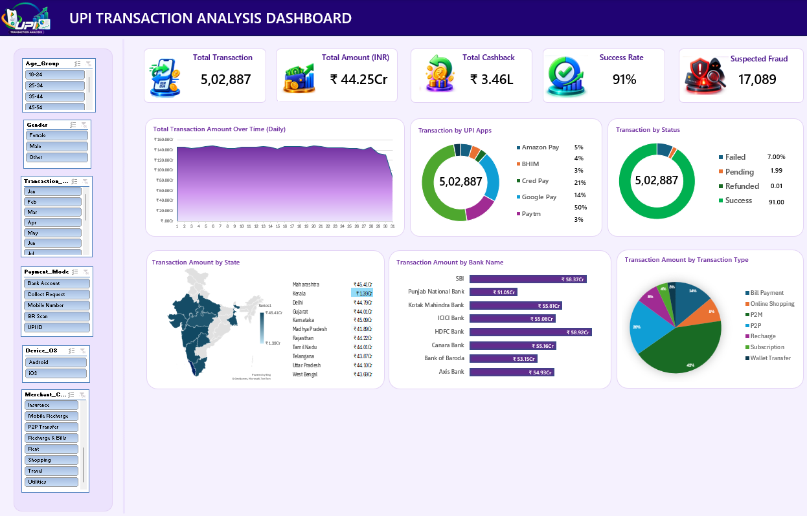

# 📊 UPI Transaction Analysis Dashboard — Excel

An interactive **UPI Transaction Analysis Dashboard** built using Microsoft Excel to analyze transaction volume, transaction amount, success rate, cashback, fraud indicators, time-based trends, product categories, and store locations.

The project demonstrates practical application of **Advanced Excel, data analysis, Pivot Tables, formulas, charts, slicers, conditional formatting, and dashboard design** on a large transaction dataset containing **5+ lakh records**.

---

## 📌 Project Overview

The objective of this project is to transform large-scale UPI transaction data into an interactive and easy-to-understand analytical dashboard.

The dashboard helps analyze:

- Overall transaction performance
- Transaction amount and volume
- Successful and failed transactions
- Suspected fraudulent transactions
- Cashback trends
- Daily and monthly transaction patterns
- Sales by hour
- Product category performance
- Store/location performance
- Regional and time-based trends

---

## 🖥️ Dashboard Preview


---

## 🎯 Key KPIs

The dashboard provides important Key Performance Indicators including:

- **Total Transactions**
- **Total Transaction Amount**
- **Cashback**
- **Success Rate**
- **Suspected Fraud Transactions**

These KPIs provide a quick overview of overall transaction performance.

---

## 📈 Dashboard Analysis

### 1. Transaction Trend Analysis

Analyzed transaction activity across:

- Daily transactions
- Monthly transactions
- Transaction hours
- Time-based transaction patterns

### 2. Transaction Performance

Analyzed:

- Successful transactions
- Failed transactions
- Transaction success rate
- Transaction amount
- Cashback distribution

### 3. Product Category Analysis

Analyzed transaction performance across different product categories to identify high-performing and low-performing categories.

### 4. Store Location Analysis

Compared transaction activity across different store locations and regions.

### 5. Fraud Analysis

Identified and analyzed suspected fraudulent transactions to understand potential transaction risk patterns.

---

## 🛠️ Excel Features Used

This project covers a wide range of **Advanced Excel concepts**, including:

### Excel Formulas

- `SUM`
- `SUMIFS`
- `IF`
- `Nested IF`
- `ISERROR`
- `COUNT`
- `COUNTA`
- `VLOOKUP`
- `HLOOKUP`
- `XLOOKUP`
- `INDEX`
- `MATCH`
- `FILTER`

### Data Analysis

- Pivot Tables
- GETPIVOTDATA
- Data Validation
- Conditional Formatting
- Sorting and Filtering
- Data Consolidation
- Forecasting
- Slicers
- Sparklines

### Visualization

- Column Charts
- Bar Charts
- Pie Charts
- Combo Charts
- KPI Cards
- Interactive Slicers
- Dashboard Layout & Formatting

---

## 📊 Interactive Dashboard

The dashboard uses **Slicers** to enable interactive filtering of the analysis.

Users can filter the dashboard based on dimensions such as:

- Product Category
- Store Location
- Month
- Other relevant transaction attributes

This allows users to dynamically explore transaction performance instead of relying only on static reports.

---

## 📅 Daily & Monthly Analysis

A dedicated analysis was created to study transaction patterns across:

- January to December
- Days 1–31
- Monthly transaction trends
- Daily transaction performance

This helps identify transaction peaks, low-activity periods, and seasonal patterns.

---

## 🔍 Business Questions Addressed

The dashboard helps answer questions such as:

1. What is the total transaction volume?
2. What is the total transaction amount?
3. What is the overall transaction success rate?
4. Which months have the highest transaction activity?
5. Which hours have the highest transaction volume?
6. Which product categories generate the highest transaction value?
7. Which store locations have the highest transaction activity?
8. How much cashback is generated?
9. How many transactions are suspected to be fraudulent?
10. What are the major transaction trends over time?

---

## 📂 Project Structure

```text
T388_Excel/
│
├── README.md
├── Dashboard.png
├── Dashboard_Project/
├── Dataset_Dmart.xlsx
└── Other Excel Project Files
```

---

## 📦 Dataset

The project works with a large UPI transaction dataset containing **5+ lakh transaction records**.

Due to GitHub's **100 MB individual file-size limitation**, the complete Excel workbook containing the large dataset is not included in the GitHub repository.

The dashboard and analysis were developed using the complete dataset locally.

---

## 💡 Key Learning Outcomes

Through this project, I gained practical experience in:

- Handling large datasets in Excel
- Data cleaning and preparation
- Advanced Excel formulas
- Lookup functions
- Conditional logic
- Pivot Table analysis
- Interactive dashboard development
- KPI creation
- Data visualization
- Time-series analysis
- Business-oriented data analysis
- Interactive filtering using Slicers

---

## 🚀 Tools & Technologies

**Microsoft Excel**

Key skills:

`Advanced Excel` · `Data Analysis` · `Pivot Tables` · `XLOOKUP` · `INDEX-MATCH` · `SUMIFS` · `Conditional Formatting` · `Slicers` · `Charts` · `Dashboard Development`

---

